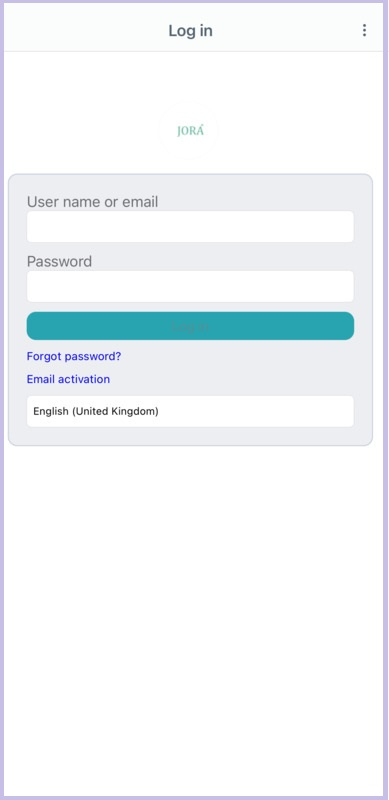
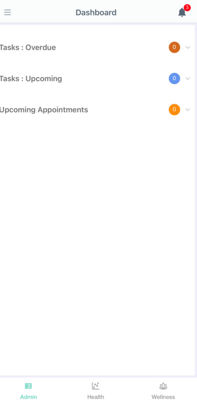
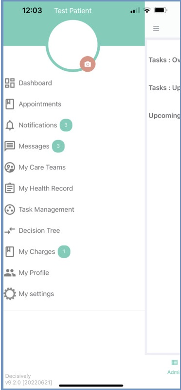
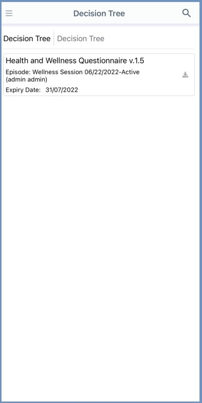

# Portfolio

  

    <h2>👨‍💻 About Me</h2>
    

      Hey there! I'm <strong>Aswani</strong>, a creative and driven software developer with a passion for turning ideas into reality through code. Whether it's crafting seamless user experiences or architecting robust back-end systems, I love taking on challenges and learning new technologies along the way.
    

    

      From mobile app development to web app development, I've honed my skills across a range of technologies. My toolkit includes the elegance of C# and ASP.NET Core and the versatility of Node.js and Express. I also have a knack for ensuring smooth data flow with SQL and Firebase.
    

  

  

## 💼 My Skillset
- **Languages:** C#, HTML5, CSS, JavaScript, SQLite, SQL.
- **Frameworks & Libraries:** Xamarin Forms, MAUI, ASP.NET Core, Node.js, Express. 
- **Tools & Platforms:** Git, Postman, Firebase.

## 🚀 Featured Projects
### 1. Decisively
**Tech Stack:** C#, Xamarin.Forms, SQLite, Firebase, ASP.NET Core, SQL

Decisively is a health-focused mobile application designed to help users manage their wellness efficiently.
Whether you're managing personal health routines or coordinating care for others, Decisively ensures you have all the critical information at your fingertips, empowering you to make informed decisions for a healthier life.
During the development of Decisively, I faced the challenge of being the sole developer responsible for the mobile side of the project. This included implementing offline capabilities and creating dynamic UI elements for Decision Tree (DT)  management. Balancing these responsibilities and ensuring a seamless user experience was both challenging and rewarding.

#### 📸 Application Snapshots

  
  
  
  

### 2. MPOS
**Tech Stack:** C#, Xamarin.Forms, SQLite, Firebase, ASP.NET Core, SQL.

The MPOS (Mobile Point of Sale) application enables users to sell items via mobile devices. The main challenge I faced was developing an intuitive and responsive user interface (UI) that ensured a smooth and efficient sales experience across various devices.

### 3. LatPay
**Tech Stack:** C#, Xamarin.Forms, Firebase

The Payment Application enables secure transactions by reading card details using NFC technology. The primary challenge was implementing accurate and reliable NFC reading to ensure seamless and secure payment processing. This feature simplifies transactions with a tap, providing a convenient and efficient payment experience.

## 🌐 Let's Connect
- **Email:** [aswanipu@gmail.com](mailto:aswanipu@gmail.com)
- **LinkedIn:** [linkedin.com/in/aswani-unnikrishnan](www.linkedin.com/in/aswani-unnikrishnan)
- **Git:** [your-portfolio-site.com](https://your-portfolio-site.com)

I'm always open to new opportunities, collaborations, and conversations. Let's build something amazing together!